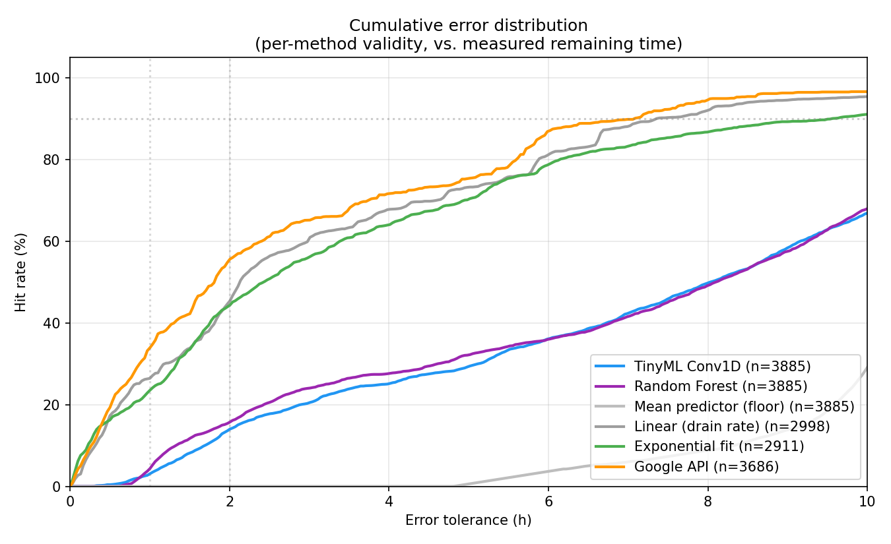
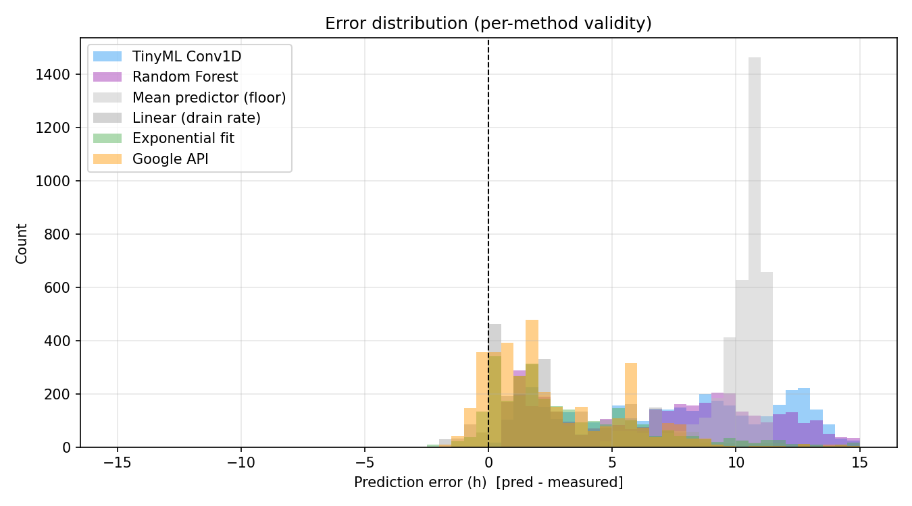

# Battery Prediction - Reproducibility Report

Auto-generated by `evaluation/report_generator.py`. Do not edit by hand.

## Executive summary

On a leakage-free segment-level test split (n=2883 sequences where all six methods produce valid predictions), evaluated against the shared `y_extrap` target with 95% bootstrap confidence intervals:

| Method | C-index | MAE (h) |
|---|---|---|
| Google API | 0.762 [0.751, 0.772] | 3.37 [3.10, 3.65] |
| Linear (drain rate) | 0.770 [0.761, 0.780] | 3.30 [3.03, 3.57] |
| Exponential fit | 0.767 [0.758, 0.776] | 3.63 [3.34, 3.91] |
| Random Forest | 0.685 [0.673, 0.695] | 4.06 [3.83, 4.28] |
| TinyML Conv1D | 0.656 [0.647, 0.664] | 4.60 [4.33, 4.82] |
| Mean predictor (floor) | 0.500 [0.500, 0.500] | 6.52 [6.29, 6.76] |

**Pairwise tests, target=y_real, Benjamini--Hochberg-adjusted over 15 tests:**

- TinyML vs. Mean predictor: ΔC-idx=+0.001, p_BH=0.816.
- Random Forest vs. Mean predictor: ΔC-idx=-0.052, p_BH=0.000.
- TinyML vs. Google API: ΔC-idx=-0.075, p_BH=0.000.

**Efficiency** (development machine, n=1000 inference runs each):
- Deployed TFLite INT8: **14.35 KB**, avg 0.0033 ms inference.
- Keras Float32 reference: 109.19 KB, 38.9985 ms avg.
- TFLite quantization works as advertised; the bottleneck is data signal, not model capacity.


**Bottom line for the paper:** the TinyML pipeline is a methodologically clean negative result. App-level smartphone sensors carry too little signal to compete with a system-process ML model that has access to ~50 internal hardware metrics. TinyML quantization itself is not at fault. See full tables and statistical tests below.

## 1. Data

Source: `data/raw/combined.csv`
Sequence length: 10
Total discharge segments: 553

## Split (segment-level, no leakage)

| Split | Sequences | mean target_extrap (h) | mean target_real (h) |
|-------|-----------|------------------------|----------------------|
| train | 13901 | 11.18 | 1.09 |
| val | 3056 | 13.76 | 0.95 |
| test | 3885 | 7.68 | 1.11 |

## Per-device sequence counts

| Split | pixel_7_pro | pixel_8_pro | pixel_9_pro_xl | xiaomi_2107113sg |
|---|---|---|---|---|
| train | 4320 | 1276 | 2201 | 6104 |
| val | 489 | 581 | 414 | 1572 |
| test | 1825 | 98 | 614 | 1348 |

## 2. TinyML training

```json
{
  "params": 5697,
  "train_loss_final": 67.11804962158203,
  "val_loss_final": 216.31369018554688,
  "train_mae_final_h": 4.556456089019775,
  "val_mae_final_h": 9.742833137512207,
  "epochs_run": 21
}
```

## 2b. Random Forest (sanity model)

Random Forest with the same flattened sliding-window features. Independent model paradigm - if it also fails to rank, the bottleneck is the data, not the network.

```json
{
  "n_estimators": 200,
  "max_depth": 20,
  "min_samples_split": 5,
  "min_samples_leaf": 5,
  "n_input_features": 100,
  "train_mae_h_extrap": 1.9523,
  "val_mae_h_extrap": 9.0461,
  "train_val_mae_ratio": 4.63,
  "train_n": 13901,
  "val_n": 3056
}
```

## 3. TFLite variants

```json
{
  "dynamic_range": {
    "size_kb": 15.9922,
    "mae_h_extrap": 5.1512,
    "avg_inference_ms": 0.002636,
    "p50_inference_ms": 0.0025,
    "p95_inference_ms": 0.002705,
    "n_runs": 200
  },
  "float16": {
    "size_kb": 17.8008,
    "mae_h_extrap": 5.1494,
    "avg_inference_ms": 0.002569,
    "p50_inference_ms": 0.0023,
    "p95_inference_ms": 0.003515,
    "n_runs": 200
  },
  "int8_full": {
    "size_kb": 14.3516,
    "mae_h_extrap": 4.9345,
    "avg_inference_ms": 0.002744,
    "p50_inference_ms": 0.0027,
    "p95_inference_ms": 0.002801,
    "n_runs": 200
  },
  "_deploy_variant": "int8_full"
}
```

## 4. Accuracy comparison (6-way)

Total test sequences: **3885**  
Common-valid (all methods): **2883** (74.2%)

### vs. measured remaining time (no extrapolation - the honest target)

**Per-method coverage (each on own valid subset)**

| Method | n | MAE (h) | RMSE (h) | ME (h) | C-index | Acc±1h | Acc±2h |
|---|---|---|---|---|---|---|---|
| tinyml | 3885 | 7.72 | 8.81 | +7.72 | 0.526 | 3.0% | 13.9% |
| random_forest | 3885 | 7.99 | 9.51 | +7.99 | 0.474 | 4.3% | 15.7% |
| mean_const | 3885 | 10.07 | 10.16 | +10.07 | 0.500 | 0.0% | 0.0% |
| linear | 2998 | 3.37 | 4.73 | +3.26 | 0.579 | 26.5% | 45.2% |
| exponential | 2911 | 4.07 | 6.44 | +4.00 | 0.573 | 23.5% | 44.2% |
| google | 3686 | 3.04 | 4.59 | +2.90 | 0.577 | 33.9% | 55.5% |

**Common subset (all methods present, 95% bootstrap CI in brackets)**

| Method | n | MAE (h) | RMSE (h) | ME (h) | C-index | Acc±1h | Acc±2h |
|---|---|---|---|---|---|---|---|
| tinyml | 2883 | 7.42 [7.28, 7.57] | 8.46 [8.33, 8.59] | +7.42 | 0.501 [0.491, 0.512] | 3.1% | 13.6% |
| random_forest | 2883 | 7.23 [7.06, 7.39] | 8.60 [8.43, 8.79] | +7.23 | 0.448 [0.438, 0.457] | 5.1% | 17.4% |
| mean_const | 2883 | 10.04 [9.99, 10.09] | 10.13 [10.09, 10.18] | +10.04 | 0.500 [0.500, 0.500] | 0.0% | 0.0% |
| linear | 2883 | 3.33 [3.21, 3.45] | 4.70 [4.53, 4.89] | +3.23 | 0.580 [0.569, 0.590] | 26.6% | 45.8% |
| exponential | 2883 | 4.09 [3.91, 4.28] | 6.46 [6.03, 6.94] | +4.02 | 0.572 [0.562, 0.582] | 23.3% | 43.9% |
| google | 2883 | 3.28 [3.16, 3.41] | 4.77 [4.56, 4.99] | +3.25 | 0.576 [0.566, 0.585] | 27.3% | 51.6% |

### vs. extrapolated target (TinyML training target - circular for TinyML)

> The TinyML model was trained on `y_extrap`. Comparing methods against this target structurally favours TinyML and is not a fair accuracy measure - shown for completeness only.

| Method | n | MAE (h) | RMSE (h) | ME (h) | C-index | Acc±1h | Acc±2h |
|---|---|---|---|---|---|---|---|
| tinyml | 2883 | 4.60 [4.33, 4.82] | 8.47 [7.78, 9.13] | +1.81 | 0.656 [0.647, 0.664] | 22.5% | 43.7% |
| random_forest | 2883 | 4.06 [3.83, 4.28] | 7.56 [6.98, 8.11] | +1.61 | 0.685 [0.673, 0.695] | 29.0% | 46.4% |
| mean_const | 2883 | 6.52 [6.29, 6.76] | 9.25 [8.69, 9.80] | +4.42 | 0.500 [0.500, 0.500] | 9.8% | 21.5% |
| linear | 2883 | 3.30 [3.03, 3.57] | 8.57 [7.69, 9.39] | -2.39 | 0.770 [0.761, 0.780] | 36.9% | 57.3% |
| exponential | 2883 | 3.63 [3.34, 3.91] | 9.04 [8.14, 9.84] | -1.60 | 0.767 [0.758, 0.776] | 37.5% | 59.0% |
| google | 2883 | 3.37 [3.10, 3.65] | 8.65 [7.74, 9.45] | -2.37 | 0.762 [0.751, 0.772] | 39.2% | 59.0% |

## 4b. Statistical significance (permutation tests)

Pairwise tests on common-valid subset (n=2883).
MAE: paired permutation (n_perm=1000). C-Index: paired bootstrap on ΔC (n_boot=500).
p-values shown: raw and Benjamini-Hochberg-adjusted (`p_BH`) over the pair-family.
Significance based on `p_BH`: `***` <0.001, `**` <0.01, `*` <0.05, `ns` otherwise.

## Target: y_real (measured)

### C-index pairwise tests

| A vs B | C(A) | C(B) | ΔC | p_raw | p_BH | sig |
|---|---|---|---|---|---|---|
| tinyml vs random_forest | 0.501 | 0.448 | +0.053 | 0.000 | 0.000 | *** |
| tinyml vs mean_const | 0.501 | 0.500 | +0.001 | 0.816 | 0.816 | ns |
| tinyml vs linear | 0.501 | 0.580 | -0.079 | 0.000 | 0.000 | *** |
| tinyml vs exponential | 0.501 | 0.572 | -0.071 | 0.000 | 0.000 | *** |
| tinyml vs google | 0.501 | 0.576 | -0.075 | 0.000 | 0.000 | *** |
| random_forest vs mean_const | 0.448 | 0.500 | -0.052 | 0.000 | 0.000 | *** |
| random_forest vs linear | 0.448 | 0.580 | -0.132 | 0.000 | 0.000 | *** |
| random_forest vs exponential | 0.448 | 0.572 | -0.124 | 0.000 | 0.000 | *** |
| random_forest vs google | 0.448 | 0.576 | -0.128 | 0.000 | 0.000 | *** |
| mean_const vs linear | 0.500 | 0.580 | -0.080 | 0.000 | 0.000 | *** |
| mean_const vs exponential | 0.500 | 0.572 | -0.072 | 0.000 | 0.000 | *** |
| mean_const vs google | 0.500 | 0.576 | -0.076 | 0.000 | 0.000 | *** |
| linear vs exponential | 0.580 | 0.572 | +0.008 | 0.000 | 0.000 | *** |
| linear vs google | 0.580 | 0.576 | +0.004 | 0.408 | 0.437 | ns |
| exponential vs google | 0.572 | 0.576 | -0.004 | 0.408 | 0.437 | ns |

### MAE pairwise tests (h)

| A vs B | MAE(A) | MAE(B) | ΔMAE | p_raw | p_BH | sig |
|---|---|---|---|---|---|---|
| tinyml vs random_forest | 7.424 | 7.225 | +0.199 | 0.006 | 0.006 | ** |
| tinyml vs mean_const | 7.424 | 10.039 | -2.615 | 0.001 | 0.001 | ** |
| tinyml vs linear | 7.424 | 3.333 | +4.091 | 0.001 | 0.001 | ** |
| tinyml vs exponential | 7.424 | 4.087 | +3.337 | 0.001 | 0.001 | ** |
| tinyml vs google | 7.424 | 3.278 | +4.146 | 0.001 | 0.001 | ** |
| random_forest vs mean_const | 7.225 | 10.039 | -2.814 | 0.001 | 0.001 | ** |
| random_forest vs linear | 7.225 | 3.333 | +3.892 | 0.001 | 0.001 | ** |
| random_forest vs exponential | 7.225 | 4.087 | +3.138 | 0.001 | 0.001 | ** |
| random_forest vs google | 7.225 | 3.278 | +3.947 | 0.001 | 0.001 | ** |
| mean_const vs linear | 10.039 | 3.333 | +6.706 | 0.001 | 0.001 | ** |
| mean_const vs exponential | 10.039 | 4.087 | +5.953 | 0.001 | 0.001 | ** |
| mean_const vs google | 10.039 | 3.278 | +6.761 | 0.001 | 0.001 | ** |
| linear vs exponential | 3.333 | 4.087 | -0.753 | 0.001 | 0.001 | ** |
| linear vs google | 3.333 | 3.278 | +0.055 | 0.386 | 0.386 | ns |
| exponential vs google | 4.087 | 3.278 | +0.809 | 0.001 | 0.001 | ** |

## Target: y_extrap (training target)

### C-index pairwise tests

| A vs B | C(A) | C(B) | ΔC | p_raw | p_BH | sig |
|---|---|---|---|---|---|---|
| tinyml vs random_forest | 0.656 | 0.684 | -0.028 | 0.000 | 0.000 | *** |
| tinyml vs mean_const | 0.656 | 0.500 | +0.156 | 0.000 | 0.000 | *** |
| tinyml vs linear | 0.656 | 0.770 | -0.114 | 0.000 | 0.000 | *** |
| tinyml vs exponential | 0.656 | 0.766 | -0.110 | 0.000 | 0.000 | *** |
| tinyml vs google | 0.656 | 0.761 | -0.105 | 0.000 | 0.000 | *** |
| random_forest vs mean_const | 0.684 | 0.500 | +0.184 | 0.000 | 0.000 | *** |
| random_forest vs linear | 0.684 | 0.770 | -0.086 | 0.000 | 0.000 | *** |
| random_forest vs exponential | 0.684 | 0.766 | -0.083 | 0.000 | 0.000 | *** |
| random_forest vs google | 0.684 | 0.761 | -0.077 | 0.000 | 0.000 | *** |
| mean_const vs linear | 0.500 | 0.770 | -0.270 | 0.000 | 0.000 | *** |
| mean_const vs exponential | 0.500 | 0.766 | -0.266 | 0.000 | 0.000 | *** |
| mean_const vs google | 0.500 | 0.761 | -0.261 | 0.000 | 0.000 | *** |
| linear vs exponential | 0.770 | 0.766 | +0.004 | 0.248 | 0.266 | ns |
| linear vs google | 0.770 | 0.761 | +0.009 | 0.092 | 0.106 | ns |
| exponential vs google | 0.766 | 0.761 | +0.005 | 0.276 | 0.276 | ns |

### MAE pairwise tests (h)

| A vs B | MAE(A) | MAE(B) | ΔMAE | p_raw | p_BH | sig |
|---|---|---|---|---|---|---|
| tinyml vs random_forest | 4.595 | 4.056 | +0.539 | 0.001 | 0.001 | ** |
| tinyml vs mean_const | 4.595 | 6.524 | -1.929 | 0.001 | 0.001 | ** |
| tinyml vs linear | 4.595 | 3.303 | +1.292 | 0.001 | 0.001 | ** |
| tinyml vs exponential | 4.595 | 3.629 | +0.967 | 0.001 | 0.001 | ** |
| tinyml vs google | 4.595 | 3.372 | +1.224 | 0.001 | 0.001 | ** |
| random_forest vs mean_const | 4.056 | 6.524 | -2.468 | 0.001 | 0.001 | ** |
| random_forest vs linear | 4.056 | 3.303 | +0.753 | 0.001 | 0.001 | ** |
| random_forest vs exponential | 4.056 | 3.629 | +0.428 | 0.001 | 0.001 | ** |
| random_forest vs google | 4.056 | 3.372 | +0.685 | 0.001 | 0.001 | ** |
| mean_const vs linear | 6.524 | 3.303 | +3.221 | 0.001 | 0.001 | ** |
| mean_const vs exponential | 6.524 | 3.629 | +2.896 | 0.001 | 0.001 | ** |
| mean_const vs google | 6.524 | 3.372 | +3.153 | 0.001 | 0.001 | ** |
| linear vs exponential | 3.303 | 3.629 | -0.325 | 0.001 | 0.001 | ** |
| linear vs google | 3.303 | 3.372 | -0.068 | 0.161 | 0.161 | ns |
| exponential vs google | 3.629 | 3.372 | +0.257 | 0.001 | 0.001 | ** |


## 5. Per-bucket analysis (where each method works/fails)

Test set: n=3885,  mean(y_real)=1.11h,  mean(y_extrap)=7.68h,  mean(segment length)=2.25h,  max(segment length)=6.44h

### By battery level at prediction time (vs. y_real, subset=common)

| Bucket | n | tinyml MAE | random_forest MAE | mean_const MAE | linear MAE | exponential MAE | google MAE | tinyml C-idx | random_forest C-idx | mean_const C-idx | linear C-idx | exponential C-idx | google C-idx |
|---|---|---|---|---|---|---|---|---|---|---|---|---|---|
| battery_0_25 | 422 | 2.18 | 2.89 | 10.31 | 0.55 | 0.57 | 0.48 | 0.49 | 0.61 | 0.50 | 0.62 | 0.61 | 0.69 |
| battery_25_50 | 533 | 3.58 | 4.67 | 10.11 | 1.73 | 1.89 | 1.91 | 0.40 | 0.43 | 0.50 | 0.57 | 0.56 | 0.60 |
| battery_50_75 | 627 | 8.22 | 8.13 | 10.12 | 3.75 | 4.37 | 4.26 | 0.58 | 0.41 | 0.50 | 0.58 | 0.58 | 0.49 |
| battery_75_100 | 1301 | 10.32 | 9.24 | 9.88 | 4.69 | 5.99 | 4.27 | 0.55 | 0.47 | 0.50 | 0.66 | 0.66 | 0.63 |

### By total segment length (vs. y_real, subset=common)

| Bucket | n | tinyml MAE | random_forest MAE | mean_const MAE | linear MAE | exponential MAE | google MAE | tinyml C-idx | random_forest C-idx | mean_const C-idx | linear C-idx | exponential C-idx | google C-idx |
|---|---|---|---|---|---|---|---|---|---|---|---|---|---|
| segment_under_2h | 1578 | 8.16 | 9.04 | 10.74 | 3.31 | 4.07 | 3.69 | 0.42 | 0.50 | 0.50 | 0.50 | 0.49 | 0.48 |
| segment_2_5h | 820 | 5.49 | 5.47 | 9.99 | 3.39 | 4.03 | 3.22 | 0.52 | 0.55 | 0.50 | 0.52 | 0.51 | 0.55 |
| segment_over_5h | 485 | 8.30 | 4.27 | 7.85 | 3.31 | 4.25 | 2.05 | 0.64 | 0.59 | 0.50 | 0.66 | 0.66 | 0.89 |

### By y_real magnitude (vs. y_real, subset=common)

| Bucket | n | tinyml MAE | random_forest MAE | mean_const MAE | linear MAE | exponential MAE | google MAE | tinyml C-idx | random_forest C-idx | mean_const C-idx | linear C-idx | exponential C-idx | google C-idx |
|---|---|---|---|---|---|---|---|---|---|---|---|---|---|
| y_real_under_1h | 1851 | 8.15 | 8.53 | 10.79 | 3.49 | 4.19 | 3.84 | 0.46 | 0.48 | 0.50 | 0.50 | 0.50 | 0.50 |
| y_real_1_3h | 727 | 5.56 | 5.58 | 9.57 | 3.28 | 4.01 | 2.63 | 0.50 | 0.48 | 0.50 | 0.52 | 0.50 | 0.54 |
| y_real_over_3h | 305 | 7.45 | 3.25 | 6.58 | 2.52 | 3.62 | 1.39 | 0.71 | 0.54 | 0.50 | 0.71 | 0.69 | 0.87 |

### By y_extrap magnitude (long-horizon analysis) (vs. y_extrap, subset=common)

| Bucket | n | tinyml MAE | random_forest MAE | mean_const MAE | linear MAE | exponential MAE | google MAE | tinyml C-idx | random_forest C-idx | mean_const C-idx | linear C-idx | exponential C-idx | google C-idx |
|---|---|---|---|---|---|---|---|---|---|---|---|---|---|
| y_extrap_under_5h | 1376 | 4.35 | 4.14 | 8.55 | 1.11 | 1.23 | 1.02 | 0.58 | 0.58 | 0.50 | 0.72 | 0.72 | 0.67 |
| y_extrap_5_15h | 1414 | 2.95 | 2.40 | 2.85 | 3.05 | 3.66 | 3.21 | 0.61 | 0.62 | 0.50 | 0.65 | 0.64 | 0.68 |
| y_extrap_15_30h | 35 | 7.42 | 6.05 | 9.07 | 12.41 | 10.48 | 15.90 | 0.70 | 0.81 | 0.50 | 0.82 | 0.72 | 0.40 |
| y_extrap_over_30h | 58 | 48.85 | 41.36 | 46.54 | 55.89 | 55.61 | 55.47 | 0.91 | 0.60 | 0.50 | 0.64 | 0.61 | 0.98 |

### By battery level [secondary: y_extrap] (vs. y_extrap, subset=common)

| Bucket | n | tinyml MAE | random_forest MAE | mean_const MAE | linear MAE | exponential MAE | google MAE | tinyml C-idx | random_forest C-idx | mean_const C-idx | linear C-idx | exponential C-idx | google C-idx |
|---|---|---|---|---|---|---|---|---|---|---|---|---|---|
| battery_0_25 | 422 | 2.14 | 1.44 | 8.34 | 1.77 | 1.82 | 1.63 | 0.34 | 0.74 | 0.50 | 0.53 | 0.52 | 0.57 |
| battery_25_50 | 533 | 1.77 | 2.74 | 8.08 | 0.91 | 0.98 | 0.60 | 0.60 | 0.65 | 0.50 | 0.80 | 0.80 | 0.87 |
| battery_50_75 | 627 | 6.60 | 5.28 | 7.25 | 5.19 | 5.52 | 5.99 | 0.45 | 0.54 | 0.50 | 0.63 | 0.63 | 0.62 |
| battery_75_100 | 1301 | 5.58 | 4.86 | 4.95 | 3.88 | 4.39 | 3.81 | 0.52 | 0.57 | 0.50 | 0.71 | 0.70 | 0.71 |


## 6. Feature importance (Random Forest)

**Aggregated importance per original feature** (sum over time-steps; higher = more useful for the RF):

| Feature | Total importance (Δ MAE in h) |
|---|---|
| brightness | +0.052 |
| hotspot_on | +0.036 |
| mobile_data_on | +0.006 |
| wifi_on | +0.003 |
| charging | +0.000 |
| screen_on | -0.009 |
| active_app_category | -0.048 |
| cpu_usage | -0.166 |
| temperature | -0.395 |
| battery_level | -5.270 |

**Top 20 individual feature×timestep cells:**

| Feature × t-offset | Δ MAE | std |
|---|---|---|
| brightness@t-6 | +0.034 | 0.014 |
| brightness@t-8 | +0.030 | 0.023 |
| brightness@t-7 | +0.027 | 0.008 |
| brightness@t-5 | +0.013 | 0.006 |
| hotspot_on@t-0 | +0.012 | 0.001 |
| hotspot_on@t-1 | +0.006 | 0.001 |
| brightness@t-9 | +0.005 | 0.028 |
| mobile_data_on@t-9 | +0.004 | 0.000 |
| hotspot_on@t-2 | +0.004 | 0.002 |
| hotspot_on@t-6 | +0.003 | 0.002 |
| hotspot_on@t-9 | +0.003 | 0.001 |
| screen_on@t-9 | +0.003 | 0.001 |
| hotspot_on@t-7 | +0.003 | 0.002 |
| screen_on@t-2 | +0.003 | 0.003 |
| hotspot_on@t-3 | +0.002 | 0.001 |
| hotspot_on@t-8 | +0.002 | 0.001 |
| wifi_on@t-6 | +0.002 | 0.000 |
| active_app_category@t-1 | +0.002 | 0.005 |
| mobile_data_on@t-2 | +0.001 | 0.000 |
| wifi_on@t-5 | +0.001 | 0.000 |

_Permutation importance on the held-out test set (n_repeats=5)._

## 6b. Model-independent data diagnostics (Pearson, Spearman, Mutual Information)

Model-independent feature/target relationships on the **train split** (n=13901).

Feature aggregation: `current` = value at the most recent timestep within the sliding window.
If Pearson, Spearman AND mutual information are all near zero across all features,
the dataset itself does not contain extractable signal for the target -- independent of the model used.

### vs y_extrap (extrapolated remaining time)

| Feature | Pearson r | Spearman r | MI (nat) |
|---|---|---|---|
| hotspot_on | +0.528 | +0.358 | 0.2250 |
| wifi_on | +0.505 | +0.389 | 0.2412 |
| mobile_data_on | -0.503 | -0.388 | 0.2413 |
| battery_level | +0.432 | +0.577 | 1.7190 |
| screen_on | -0.345 | -0.254 | 0.1548 |
| temperature | -0.238 | -0.264 | 2.0739 |
| active_app_category | -0.100 | -0.055 | 0.2881 |
| cpu_usage | -0.054 | +0.016 | 0.3131 |
| brightness | -0.024 | +0.079 | 1.1390 |
| charging (constant) | +0.000 | +0.000 | 0.0016 |

### vs y_real (measured remaining time only)

| Feature | Pearson r | Spearman r | MI (nat) |
|---|---|---|---|
| hotspot_on | +0.475 | +0.286 | 0.0559 |
| wifi_on | +0.422 | +0.231 | 0.0423 |
| mobile_data_on | -0.419 | -0.227 | 0.0419 |
| battery_level | +0.218 | +0.163 | 0.6534 |
| cpu_usage | -0.204 | -0.182 | 0.0895 |
| screen_on | -0.182 | -0.008 | 0.0362 |
| active_app_category | -0.152 | +0.004 | 0.0547 |
| temperature | -0.121 | +0.051 | 0.9297 |
| brightness | -0.027 | -0.238 | 0.3538 |
| charging (constant) | +0.000 | +0.000 | 0.0039 |

## 7. Efficiency benchmark

| Variant | Size (KB) | Params | Avg latency (ms) | p95 latency (ms) | n |
|---|---|---|---|---|---|
| keras_float32 | 109.19 | 5697 | 38.9985 | 43.573 | 1000 |
| tflite_dynamic_range | 15.99 | - | 0.0031 | 0.0033 | 1000 |
| tflite_float16 | 17.8 | - | 0.0029 | 0.0031 | 1000 |
| tflite_int8_full | 14.35 | - | 0.0033 | 0.0034 | 1000 |

_Measured on the development machine; latencies are an upper bound for embedded NPU but a lower bound for app-level overhead. Warmup=50, runs=1000._

## 8. Figures

- Cumulative error: 
- Error histogram: 
- Scatter plots: `figures/scatter_<method>.png`

## 9. Methodology notes (for the paper)

- Train/Val/Test split is **segment-level** (not sequence-level) to prevent leakage: sliding-window sequences from the same discharge segment never appear in both train and test.
- Two targets are stored per sample: `y_real` (measured time to segment end, no extrapolation) and `y_extrap` (training target with drain-rate extrapolation). Final results are reported against `y_real`.
- Coverage is method-specific (Google API, exponential fit and linear baseline may be undefined at the start of a segment or when the API is unavailable). The 'common subset' table evaluates only on samples where all methods produce a value - this is the only fair head-to-head comparison.
- Concordance index (Harrell 1982) is reported alongside MAE because the training target itself is approximate (Li et al. 2018 use C-index for the same reason on smartphone battery data).
- Efficiency is measured on the dev machine; the deployed TFLite variant is configured via `tflite.deploy_variant` in `configs/default.yaml`.
- A **mean predictor** baseline (always predicts the train mean of `y_extrap`) is included. It defines a lower-bound floor: any learning model that does not beat it on **C-index** has not learned a feature->output relationship.
- A **Random Forest** sanity model with the same features is included. Used to rule out that the Conv1D-specific architecture (rather than the data) is the bottleneck.
- The 'remaining time to 0%' is censored data: phones rarely discharge to 0% in real use. We therefore use Harrell's concordance index (Li et al. 2018) as the primary metric, since it remains valid under target approximation. MAE/RMSE are reported as secondary against `y_extrap`, the common drain-rate-extrapolated target.

